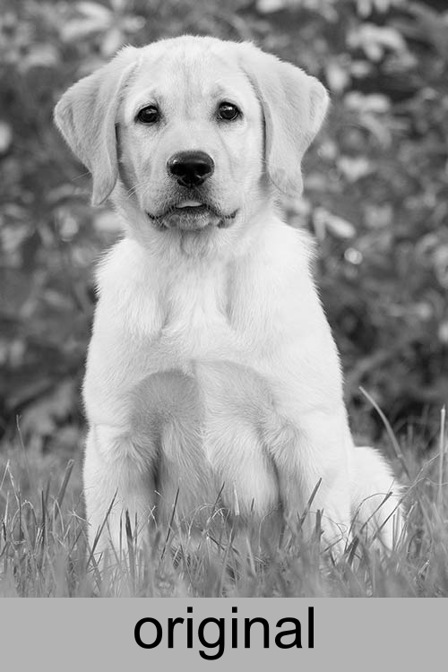
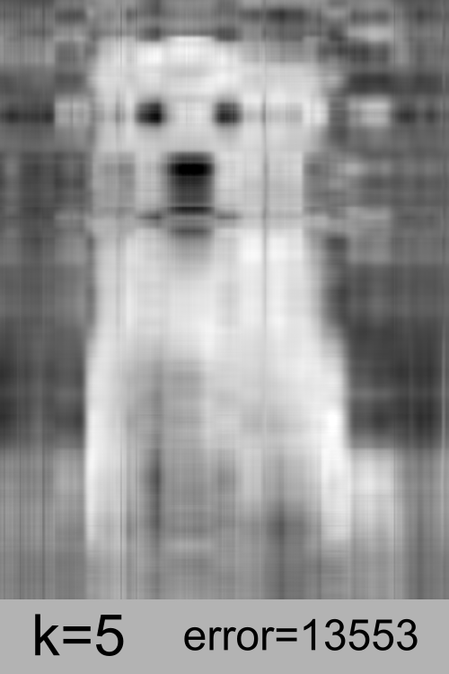

# Image-Compression-using-SVD
This is a program that compresses digital images using Singular Value Decomposition

In this project I apply the concept of Singular Value Decomposition (SVD) that I learned during Linear Algebra classes. SVD essentially revolves around factorizing a matrix. A matrix A can be factorised as  where the columns of  consist of the "left singular vectors", the columns of  consist of the "right singular vectors" and the diagonal entries of  consist of the "singular values"

## Requirements:
The libraries that were used are:
* **Numpy**
* **Opencv** (cv2)

## Approximating a matrix:
**A matrix  can be approximated i.e compressed by factorizing the matrix using SVD and recomposing it by using a subset of the singular vectors and singular values instead of using all of them.** The approximated matrix is called . An image is essentially a matrix therefore the same concept can be applied. (Technically a colored image is not a matrix because each pixel conists of 3 values for red, green and blue, which is why in this project we convert the image to grayscale which associates one value per pixel). Although one could perform SVD on the "red matrix", "green matrix" and "blue matrix" seperately and sum the result. 

The **k value** in the program (found on line 51) can be adjusted for different results. A higher value of k is a better approximation of the original image while a lower value in worse. Below are examples on a test image with various k values. The error term is determined using the **Frobenius Norm** of     

  
  
